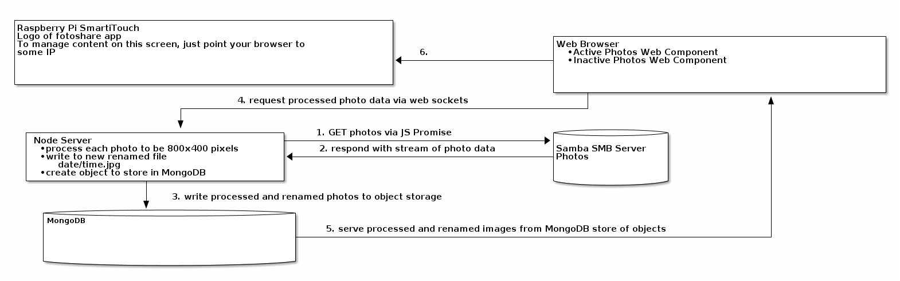

# Introduction
I have a samba server with photos I've amassed over the few years since my daughter was born.  I'd like to have a custom app to show all pictures on a nice
dispaly in the house.  Because I don't use Facebook, or any other service to share my photos, I need to find a solution that uses my samba NAS server to
enjoy and watch the photos of my daughter's growth and development over the years and as a way to share those photos to any guest of my home.
# Hardware
I'm building this web app to be able to take the photos from my local area network Samba NAS server on my Raspberry Pi that uses the WDLabs hard drive to
show at my home on a Smarti Touch.  Below is the list of hardware I'm using to create my app.
- Raspberry Pi 3
- WDLabs 250 GB PiDrive
- Smarti Touch 7" Touchscreen

A diagram on how all that hardware will play with software is illustrated below.  I've put the time to illustrate my strategy before I write any code.

## TODO build express server
- [-] setup express to serve app  
  - [-] create project with npm
    - [X] configure package-json

      Understand [semantic versioning](https://docs.npmjs.com/about-semantic-versioning).  The link has a good video that describes npm's semantic versioning.

      Installed node packages for project:
      - @babel/core
      - @babel/preset-env
      - @babel/preset-react
      - babel-loader
      - babel-preset-es2020
      - nodemon
      - webpack
      - sass-loader, sass, style-loader, and css-loader to better style react components

      Installed node dependency packages for project:
      - cors
      - [X] express
        setup in node.js
      - [X] react
      - react-dom      
    - [X] setup webpack to work with Sass and Babel
    - [ ] setup source map in webpack for easier jsx debugging
    - [ ] setup Hot Module Replacement
## TODO Build the app client interface
- [ ] create HTML markup for client interface of app

  I will use React to help with the UI.
  No intention to use a JS template engine, but instead will just use a pure html file.
  Will use Sass, but will look into [PostCSS](https://postcss.org/) for maintaining the app's style.